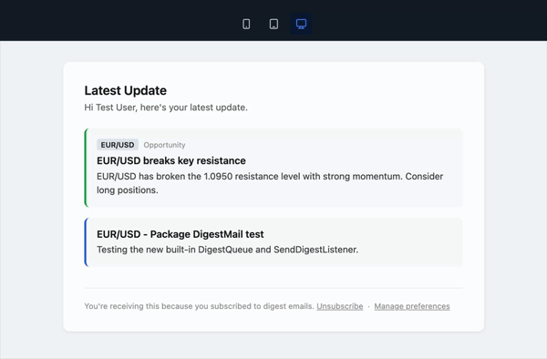

# laravel-email-preference-center

Give your users control over which emails they receive and how often, with one-click unsubscribe and a self-service preference center. No login required.

[](https://packagist.org/packages/lchris44/laravel-email-preference-center)
[](https://packagist.org/packages/lchris44/laravel-email-preference-center)
[](https://packagist.org/packages/lchris44/laravel-email-preference-center)



## Documentation

- [Installation](../../wiki/Installation)
- [Configuration](../../wiki/Configuration)
- [Categories](../../wiki/Categories)
- [Checking Preferences](../../wiki/Checking-Preferences)
- [Unsubscribe Links and Headers](../../wiki/Unsubscribe-Links-and-Headers)
- [Preference Center](../../wiki/Preference-Center)
- [Digest Batching](../../wiki/Digest-Batching)
- [GDPR Consent Log](../../wiki/GDPR-Consent-Log)

## Features

- Per-category email preferences with required (locked) and optional categories
- Frequency controls per category: instant, daily digest, weekly digest, or never
- One-click unsubscribe via signed URLs, no login required
- Automatic `List-Unsubscribe` and `List-Unsubscribe-Post` headers (Gmail/Yahoo 2024 compliance)
- Built-in digest batching with `DigestQueue::dispatch()` - one call handles instant send and daily/weekly queuing
- Queue support for digest emails - set `digest_queue` to dispatch via Laravel's queue worker
- GDPR consent log - every change recorded with timestamp, IP, and source
- Self-service preference center UI included
- Works with any notifiable model, not just `User`

## Requirements

- PHP 8.2+
- Laravel 10, 11, or 12

## Installation

```bash
composer require lchris44/laravel-email-preference-center
```

```bash
php artisan vendor:publish --tag=email-preferences-config
php artisan migrate
```

> Migrations run automatically from the package. No need to publish them unless you want to modify the schema.

## Setup

### 1. Add the trait to your User model

```php
use Lchris44\EmailPreferenceCenter\Traits\HasEmailPreferences;

class User extends Authenticatable
{
    use HasEmailPreferences;
}
```

### 2. Define your categories

In `config/email-preferences.php`:

```php
'categories' => [
    'security' => [
        'label'       => 'Security Alerts',
        'description' => 'Password changes and new login alerts.',
        'required'    => true, // cannot be unsubscribed
    ],
    'digest' => [
        'label'       => 'Activity Digest',
        'description' => 'A summary of your recent activity.',
        'required'    => false,
        'frequency'   => ['instant', 'daily', 'weekly', 'never'],
    ],
    'marketing' => [
        'label'       => 'Product Updates & Promotions',
        'description' => 'New features, offers, and announcements.',
        'required'    => false,
    ],
],
```

## Checking Preferences

```php
$user->prefersEmail('marketing');       // true or false
$user->emailFrequency('digest');        // 'instant', 'daily', 'weekly', or 'never'
```

Always check `prefersEmail()` before sending:

```php
if (! $user->prefersEmail('marketing')) {
    return;
}

Mail::to($user)->send(new MarketingMail($user));
```

## Unsubscribe Links and Headers

Add the `BelongsToCategory` trait to any `Mailable` to inject RFC 8058 unsubscribe headers automatically:

```php
use Lchris44\EmailPreferenceCenter\Traits\BelongsToCategory;

class MarketingMail extends Mailable
{
    use BelongsToCategory;

    public string $category = 'marketing';

    public function __construct(public User $user)
    {
        $this->withUnsubscribeHeaders($user);
    }
}
```

This injects two headers into every outgoing email:

```
List-Unsubscribe: <https://yourapp.com/email-preferences/unsubscribe?...&signature=...>
List-Unsubscribe-Post: List-Unsubscribe=One-Click
```

Gmail and Apple Mail show an "Unsubscribe" button. One-click POST unsubscribe is handled automatically.

The `$unsubscribeUrl` variable is available in your Blade view:

```blade
<a href="{!! $unsubscribeUrl !!}">Unsubscribe</a>
```

## Preference Center

A self-service page where users manage all their categories at once. Access is via a signed URL. No login required.

### Generate a link

```php
use Lchris44\EmailPreferenceCenter\Support\SignedUnsubscribeUrl;

$url = SignedUnsubscribeUrl::generateForCenter($user);
```

### Customise the view

```bash
php artisan vendor:publish --tag=email-preferences-views
```

This copies the view to `resources/views/vendor/email-preferences/preference-center.blade.php`.

## Digest Batching

The package handles the entire digest pipeline for you. One call routes each user to an immediate send or a scheduled batch, depending on their chosen frequency.

### 1. Set the mailable

In `config/email-preferences.php`, point to your mailable (or keep the package default):

```php
// Default - works out of the box, publish to customise
'digest_mailable' => \Lchris44\EmailPreferenceCenter\Mail\DigestMail::class,
```

The mailable must accept `(mixed $notifiable, Collection $items, string $frequency)`.

Publish the default mail and view to customise them:

```bash
php artisan vendor:publish --tag=email-preferences-digest
```

### 2. Dispatch items from your listener

```php
use Lchris44\EmailPreferenceCenter\Support\DigestQueue;

class YourEventListener
{
    public function handle(YourEvent $event): void
    {
        DigestQueue::dispatch($user, 'digest', 'your_type', [
            'title' => $event->title,
            'body'  => $event->body,
        ]);
    }
}
```

`DigestQueue::dispatch()` handles everything:
- Skips users who have opted out
- **Instant** - saves the item and fires `DigestReadyToSend` immediately
- **Daily / Weekly** - saves the item. The artisan command sends it later

### 3. Register your listener

In `AppServiceProvider`:

```php
Event::listen(YourEvent::class, YourEventListener::class);
```

> `DigestReadyToSend → SendDigestListener` is auto-registered by the package. You do not need to wire it up.

### Queue support

To send digest emails via the queue worker, set `digest_queue` to the queue name:

```php
// config/email-preferences.php
'digest_queue' => env('EMAIL_PREFERENCES_DIGEST_QUEUE', null),
```

```env
# .env
EMAIL_PREFERENCES_DIGEST_QUEUE=emails
```

When set, the package calls `Mail::to()->queue()` instead of `send()`. The mailable must use the `Queueable` trait (the built-in `DigestMail` already does).

### Running the command manually

```bash
php artisan email-preferences:send-digests daily
php artisan email-preferences:send-digests weekly
```

### Auto-scheduling

When `auto_schedule = true` in the config, the commands are scheduled automatically:

- Daily digest: every day at 08:00
- Weekly digest: every Monday at 08:00

Override via environment variables:

```env
EMAIL_PREFERENCES_DAILY_SCHEDULE="0 9 * * *"
EMAIL_PREFERENCES_WEEKLY_SCHEDULE="0 9 * * 1"
```

## Managing Preferences Programmatically

```php
$user->subscribe('marketing');
$user->unsubscribe('marketing');
$user->setEmailFrequency('digest', 'weekly');

// Specify the source of the change (recorded in the audit log)
$user->subscribe('marketing', 'admin');
$user->unsubscribe('marketing', 'admin');
```

## GDPR Consent Log

Every preference change is recorded in an immutable audit log.

```php
$user->wasSubscribedTo('marketing', '2026-01-01'); // true or false

$log = $user->lastConsentFor('marketing');
$log->action;     // 'subscribed' or 'unsubscribed'
$log->via;        // 'preference_center', 'unsubscribe_link', 'api', 'admin'
$log->ip_address;
$log->created_at;

$user->emailPreferenceLogs()->forCategory('marketing')->get();
```

## License

MIT - [Lenos Christodoulou](https://github.com/lchris44)
