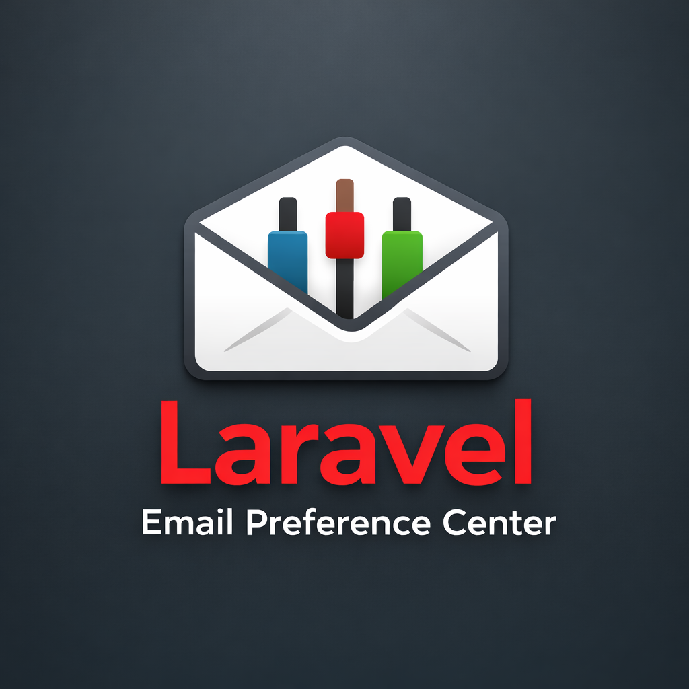

<p align="center">
  
</p>

<p align="center">
  <strong>A complete, drop-in email preference management system for Laravel applications</strong>
</p>

<p align="center">Stop losing subscribers to a binary unsubscribe. Let users choose exactly what lands in their inbox.</p>

<p align="center">
  <a href="https://packagist.org/packages/lchris44/laravel-email-preference-center" style="text-decoration:none"></a>
  <a href="https://github.com/lchris44/laravel-email-preference-center/actions/workflows/run-tests.yml" style="text-decoration:none"></a>
  <a href="https://packagist.org/packages/lchris44/laravel-email-preference-center" style="text-decoration:none"></a>
</p>

---

## Documentation

📚 **[Read the full documentation](https://darkorchid-spoonbill-752711.hostingersite.com/)**

The documentation includes:

- Installation & Quick Start
- Configuration reference
- Notification Channel
- Category Declaration (attribute, interface, config map)
- Preference Management
- Preference Center UI
- One-Click Unsubscribe (RFC 8058)
- Digest Batching
- GDPR Consent Log
- Events
- Artisan Commands
- API Reference
- Database Schema
- Routes

---

## Why Use This Package?

Most applications offer users a single "unsubscribe from everything" link. That's a bad experience — and you lose subscribers who only wanted fewer emails, not none at all.

This package gives your users a real preference center: they choose which email categories they receive, how often they get them, and can unsubscribe from individual categories without opting out of everything. You get better deliverability, fewer spam complaints, and users who actually stay engaged.

**Features at a glance:**

- 📬 **Smart notification channel** — drop-in replacement for `'mail'`, routes automatically based on preferences
- 🎛️ **Self-service preference center** — a ready-to-use Blade UI where users manage all their email categories and frequencies in one place, accessible via a signed URL with no login required
- 🔗 **One-click unsubscribe** — RFC 8058 compliant, works natively in Gmail and Apple Mail (required for bulk senders since 2024)
- 📋 **Digest batching** — automatic daily and weekly digest scheduling, zero extra code
- 🔒 **GDPR consent log** — every preference change recorded with IP, user agent, and timestamp
- 🧩 **Polymorphic** — works with any notifiable model, not just `User`
- ⚡ **Three ways to declare categories** — PHP attribute, interface, or config map for third-party notifications

---

## Installation

Install via Composer:

```bash
composer require lchris44/laravel-email-preference-center
```

Publish the configuration and run migrations:

```bash
php artisan vendor:publish --tag=email-preferences-config
php artisan migrate
```

---

## Quick Example

Replace `'mail'` with `'email-preferences'` in your notification and declare a category:

```php
use Lchris44\EmailPreferenceCenter\Attributes\EmailCategory;

#[EmailCategory('marketing')]
class NewsletterNotification extends Notification
{
    public function via(object $notifiable): array
    {
        return ['email-preferences'];
    }
}
```

The package automatically checks the user's preferences — sending immediately, queuing to a digest, or dropping silently depending on their settings.

---

## Contributing

Contributions are welcome!

- Fork the repository
- Create a feature branch
- Submit a pull request

---

## License

MIT — [Lenos Christodoulou](https://github.com/lchris44)

---

## Support

If you encounter issues, please open an issue on GitHub:

https://github.com/lchris44/laravel-email-preference-center/issues
